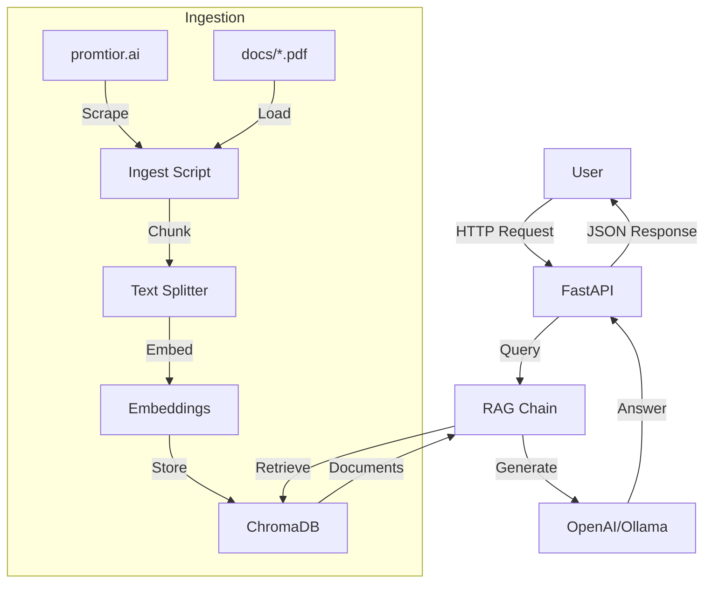

# Promtior RAG Assistant

Chatbot basado en RAG (Retrieval Augmented Generation) que responde preguntas sobre Promtior utilizando LangChain, FastAPI y OpenAI.

## Quick Start

### Prerequisites

- Docker y Docker Compose (para desarrollo local con Ollama)
- Python 3.12+
- `uv` package manager ([install](https://github.com/astral-sh/uv))

### 🚀 One-Line Setup (Recommended)

```bash
# Opción 1: Usar comando quickstart (con mensajes de progreso)
make quickstart

# Opción 2: Comando combinado directo
make install && make ollama && make ingest && make dev
```

Esto ejecutará automáticamente:
1. ✅ Instala dependencias con `uv`
2. ✅ Inicia Ollama en Docker y descarga modelos (~1GB)
3. ✅ Ingiere datos y crea ChromaDB con metadata de embeddings
4. ✅ Inicia el servidor en http://localhost:8000

⏱️ **Tiempo total**: ~10-15 minutos (primera vez, debido a descarga de modelos)

---

### Local Development (Paso a Paso)

Si prefieres ejecutar los comandos individualmente:

```bash
# 1. Install dependencies
make install

# 2. Copy environment file (opcional)
cp .env.example .env

# 3. Start Ollama with Docker
make ollama
# This will:
# - Start Ollama in Docker (16GB memory limit)
# - Download tinyllama model (~1GB)
# - Download nomic-embed-text embeddings model

# 4. Ingest data into ChromaDB
make ingest

# 5. Run API server
make dev
# API runs on http://localhost:8000
```

### Production (OpenAI)

El entorno de producción usa OpenAI en lugar de Ollama. Configura las variables de entorno:

```bash
# Variables requeridas en producción
OPENAI_API_KEY=sk-...
LLM_PROVIDER=openai
USE_OPENAI_EMBEDDINGS=true
```

## Usage

```bash
# Health check
curl http://localhost:8000/health

# Ask a question
curl "http://localhost:8000/ask?q=What services does Promtior offer?"

# Ask in Spanish
curl "http://localhost:8000/ask?q=¿Qué servicios ofrece Promtior?"
```

## API Endpoints

| Endpoint | Description |
|----------|-------------|
| `GET /` | API information and usage examples |
| `GET /health` | Health check |
| `GET /ask?q=question` | Ask a question about Promtior |
| `POST /admin/reingest?admin_key=KEY` | Re-ingest data into ChromaDB |

## Architecture



## Tech Stack

| Component | Technology | Purpose |
|-----------|------------|---------|
| Web Framework | FastAPI | REST API server |
| RAG | LangChain | Chain orchestration |
| Vector DB | ChromaDB | Embeddings storage |
| LLM (dev) | Ollama | Local AI model |
| LLM (prod) | OpenAI | Cloud AI model |
| Embeddings | OpenAI/text-embedding-3-small | Text vectorization |
| Deployment | Railway | Cloud hosting |
| Testing | pytest | Unit tests |

## Documentation

| Topic | File |
|-------|------|
| **⭐ RAG v2.1 Improvements** | [docs/RAG_V2_IMPROVEMENTS.md](docs/RAG_V2_IMPROVEMENTS.md) |
| **Local Setup** | [docs/LOCAL_SETUP.md](docs/LOCAL_SETUP.md) |
| **Testing Embedding Metadata** | [docs/TESTING_EMBEDDING_METADATA.md](docs/TESTING_EMBEDDING_METADATA.md) |
| **RAG Troubleshooting** | [docs/RAG_TROUBLESHOOTING.md](docs/RAG_TROUBLESHOOTING.md) |
| **Railway Deployment** | [docs/RAILWAY_DEPLOYMENT.md](docs/RAILWAY_DEPLOYMENT.md) |
| **Troubleshooting** | [docs/TROUBLESHOOTING.md](docs/TROUBLESHOOTING.md) |
| **API Configuration** | [docs/API_CONFIGURATION.md](docs/API_CONFIGURATION.md) |
| Architecture + Diagrams | [docs/ARCHITECTURE.md](docs/ARCHITECTURE.md) |
| Cleanup Summary | [docs/CLEANUP_SUMMARY.md](docs/CLEANUP_SUMMARY.md) |

## Configuration

### Environment Variables

| Variable | Description | Default |
|----------|-------------|---------|
| `ENVIRONMENT` | Environment (development/production) | development |
| `LLM_PROVIDER` | LLM provider (openai/ollama) | auto (openai in prod) |
| `OPENAI_API_KEY` | OpenAI API key | - |
| `OPENAI_MODEL` | OpenAI model | gpt-4o-mini |
| `OPENAI_EMBEDDING_MODEL` | Embeddings model | text-embedding-3-small |
| `OLLAMA_BASE_URL` | Ollama URL | http://localhost:11434 |
| `OLLAMA_MODEL` | Ollama model | llama2 |
| `CHROMA_PERSIST_DIRECTORY` | ChromaDB directory | ./data/chroma_db |
| `ADMIN_REINGEST_KEY` | Key for re-ingest endpoint | - |

## Data Sources

El sistema ingiere datos de:

1. **Sitio web**: https://promtior.ai (scraping con BeautifulSoup)
2. **PDFs**: Archivos en el directorio `docs/` (carga con pypdf)

Los documentos se dividen en chunks de ~1000 caracteres y se almacenan en ChromaDB con embeddings.

## Testing

```bash
# Run unit tests
make test

# Run all tests including integration
make test-all
```

## Deployment

El proyecto está configurado para deploy en Railway. Ver [docs/](docs/) para detalles.

### Railway Variables

```bash
ENVIRONMENT=production
LLM_PROVIDER=openai
OPENAI_API_KEY=sk-...
USE_OPENAI_EMBEDDINGS=true
```

## License

MIT
