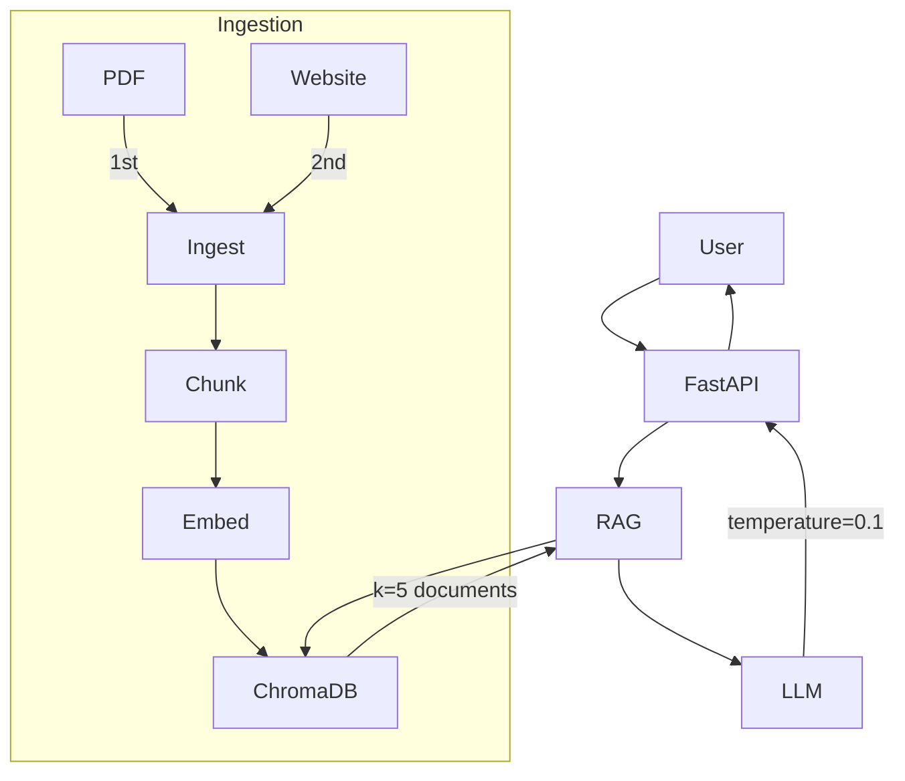

# Promtior RAG Assistant

Chatbot RAG (Retrieval Augmented Generation) que responde preguntas sobre Promtior usando FastAPI, LangChain y ChromaDB.

## Production Status: ✅ v2.1 (Feb 2026)

- **URL**: https://promtior-chat-assistant-production.up.railway.app

## Production Examples

```bash
# What services does Promtior offer?
curl --location 'https://promtior-chat-assistant-production.up.railway.app/ask?q=What%20services%20does%20Promtior%20offer%3F'

# When was the company founded?
curl --location 'https://promtior-chat-assistant-production.up.railway.app/ask?q=When%20was%20the%20company%20founded%3F'
```

## Quick Start

```bash
# Install dependencies
make install

# Start Ollama (development)
make ollama

# Ingest data into ChromaDB
make ingest

# Run server
make dev
```

## Environment

| Variable | Dev | Production |
|----------|-----|------------|
| LLM Provider | Ollama (tinyllama) | OpenAI (gpt-4o-mini) |
| Embeddings | nomic-embed-text | text-embedding-3-small |
| ChromaDB | ./data/chroma_db | /tmp/chroma_db |

## API Endpoints

| Method | Endpoint | Description |
|--------|----------|-------------|
| GET | `/` | API info |
| GET | `/health` | Health check |
| GET | `/ask?q=question` | Ask a question |
| POST | `/admin/reingest?admin_key=KEY` | Re-ingest data |

## Data Sources

1. **PDF** (priority) - `docs/AI-Engineer-Test-Promtior.pdf`
2. **Website** - `https://promtior.ai`

Ingestion order matters: PDFs first for detailed info (founding date), website for supplementary content.

## Architecture



## Key Features v2.1

- **Few-shot prompts** - Previene alucinaciones
- **Semantic chunking** - Mejor calidad de embeddings
- **Preprocessing** - Limpieza de texto antes de embedding
- **Clean Architecture** - Domain/Application/Infrastructure/Presentation
