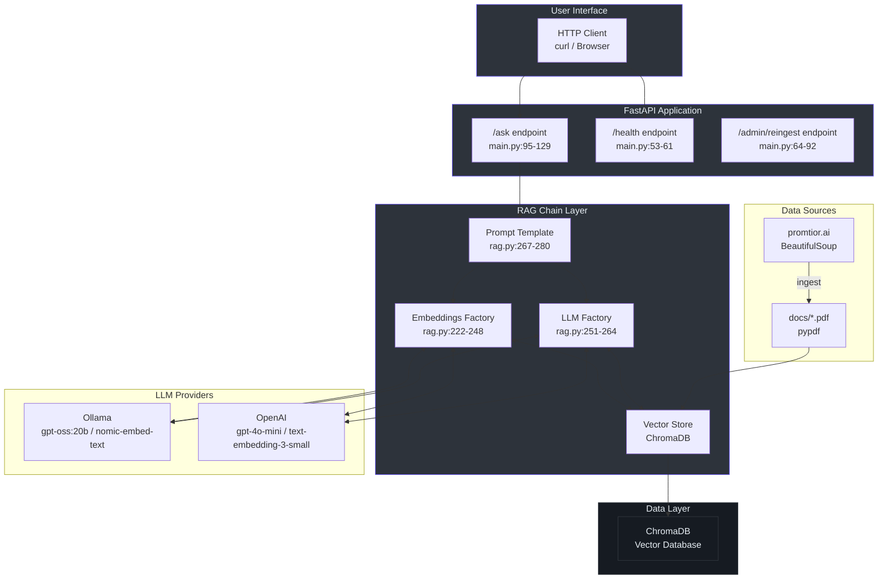
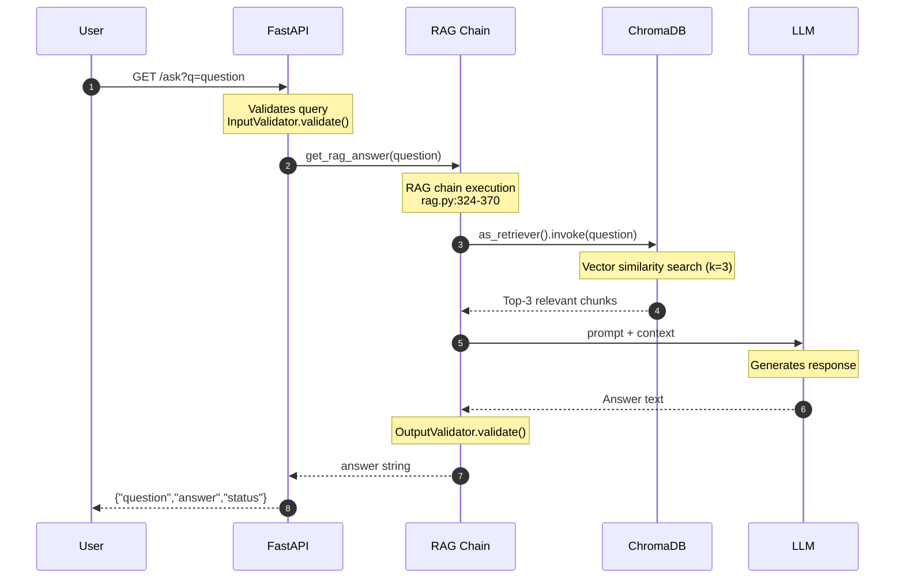
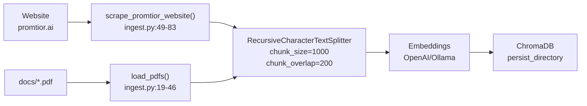
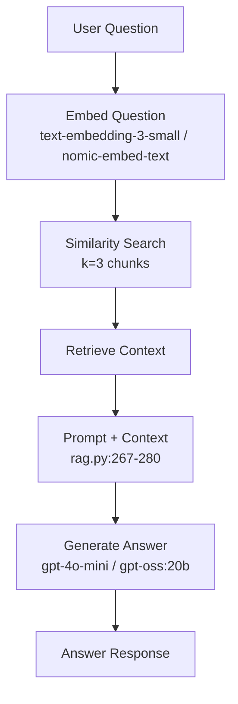

# Arquitectura del Sistema

## 1. Overview

Este documento describe la arquitectura técnica del Promtior RAG Chatbot Assistant, un sistema de Retrieval Augmented Generation (RAG) que responde preguntas sobre Promtior utilizando inteligencia artificial.

El sistema existe para proporcionar respuestas contextualizadas a preguntas sobre la empresa, aprovechando el contenido del sitio web y PDFs de Promtior almacenado en una base de datos vectorial.

## 2. Architecture Diagram



## 3. Request Flow



## 4. Component Details

### 4.1 FastAPI Application (`main.py`)

| Componente | Línea | Propósito |
|------------|-------|-----------|
| `app = FastAPI()` | 17-21 | Inicialización de aplicación FastAPI |
| CORS middleware | 23-30 | Permitir solicitudes cross-origin |
| `/` endpoint | 33-50 | Información de la API |
| `/health` endpoint | 53-61 | Health check |
| `/ask` endpoint | 95-129 | Procesamiento de preguntas |
| `/admin/reingest` endpoint | 64-92 | Re-ingestión de datos |

### 4.2 Configuration (`config.py`)

| Variable | Línea | Descripción |
|----------|-------|-------------|
| `Settings` class | 7-44 | Configuración centralizada con Pydantic |
| Environment switching | 23-26 | Dual support (Ollama/OpenAI) |
| ChromaDB path | 40 | Directorio de persistencia |

### 4.3 RAG Chain (`rag.py`)

| Función | Líneas | Propósito |
|---------|--------|-----------|
| `InputValidator.validate()` | 74-86 | Validación de entrada |
| `OutputValidator.validate()` | 93-100 | Validación de salida |
| `CustomOllamaEmbeddings` | 103-164 | Embeddings con auth para Ollama |
| `CustomOllamaChat` | 167-219 | Chat con auth para Ollama |
| `_get_embeddings()` | 222-248 | Factory de embeddings (switch Ollama/OpenAI) |
| `_get_llm()` | 251-264 | Factory de LLM (switch Ollama/OpenAI) |
| `_get_vector_store()` | 283-290 | Cacheo de ChromaDB con LRU |
| `_get_qa_chain()` | 293-306 | Construcción del chain RetrievalQA |
| `get_rag_answer()` | 324-370 | Ejecución asíncrona del RAG con retry |

### 4.4 Data Ingestion (`ingest.py`)

| Función | Líneas | Propósito |
|---------|--------|-----------|
| `load_pdfs()` | 19-46 | Carga de PDFs con pypdf |
| `scrape_promtior_website()` | 49-83 | Web scraping con BeautifulSoup |
| `ingest_data()` | 86-164 | Pipeline completo de ingestión |

## 5. Environment Switching

El sistema implementa un patrón factory para seleccionar el proveedor de LLM:

```python
# rag.py:251-264
def _get_llm() -> BaseChatModel:
    if settings.llm_provider == "openai":
        return ChatOpenAI(model=settings.openai_model, temperature=0.7)
    return CustomOllamaChat(model=settings.ollama_model, temperature=0.7, base_url=settings.ollama_base_url)
```

| Entorno | LLM | Embeddings | Costo |
|---------|-----|------------|-------|
| Development | Ollama (llama2) | nomic-embed-text | $0 |
| Production | OpenAI (gpt-4o-mini) | text-embedding-3-small | ~$2-10/mes |

## 6. Data Flow

### 6.1 Ingestion Flow



### 6.2 Query Flow



## 7. Source Code References

| Archivo | Componente | Líneas |
|---------|------------|--------|
| `main.py` | FastAPI app, endpoints | 1-136 |
| `config.py` | Settings, environment vars | 1-45 |
| `rag.py` | RAG chain, factories | 1-371 |
| `ingest.py` | Web scraping, PDF loading, ingestion | 1-169 |
| `Dockerfile` | Container definition | - |
| `pyproject.toml` | Dependencies | - |

## 8. Technology Stack

| Categoria | Tecnologia | Version |
|-----------|------------|---------|
| Web Framework | FastAPI | 0.110+ |
| RAG Framework | LangChain | 1.0+ |
| Vector Database | ChromaDB | 0.4+ |
| Development LLM | Ollama + gpt-oss:20b | Latest |
| Production LLM | OpenAI gpt-4o-mini | Latest |
| Embeddings | nomic-embed-text / text-embedding-3-small | Latest |
| PDF Processing | pypdf | 6.7+ |
| Deployment | Railway | Latest |

## 9. Prompt Template

El sistema utiliza un prompt en español:

```
Eres un asistente que responde preguntas sobre Promtior, una empresa de consultoría 
tecnológica y organizacional especializada en inteligencia artificial.

Usa el siguiente contexto para responder la pregunta. Si no sabes la respuesta 
basándote en el contexto, di que no tienes esa información.

Contexto: {context}

Pregunta: {question}

Respuesta:
```

## 10. Retry Logic

El sistema implementa retry exponencial con 3 intentos:

```python
# rag.py:346-370
max_retries = 3
for attempt in range(max_retries):
    try:
        # RAG execution
    except Exception as e:
        wait_time = 2 ** attempt  # 1s, 2s, 4s
        time.sleep(wait_time)
```
