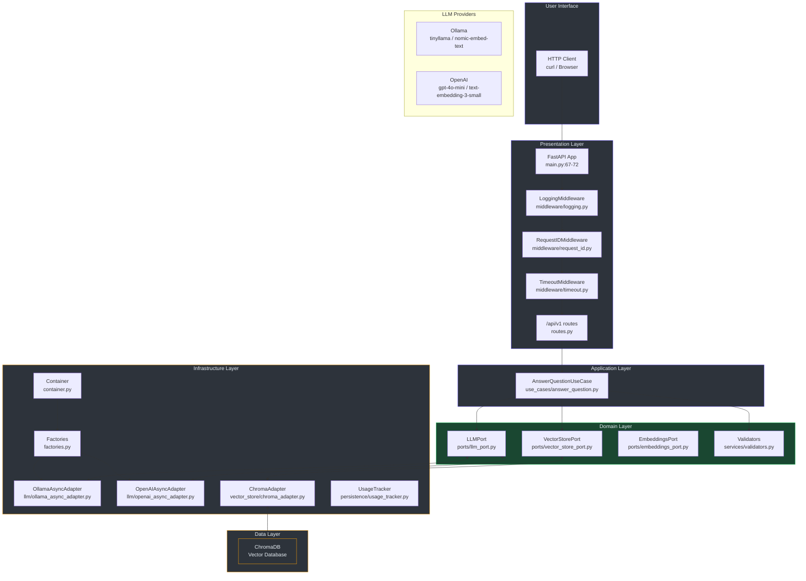
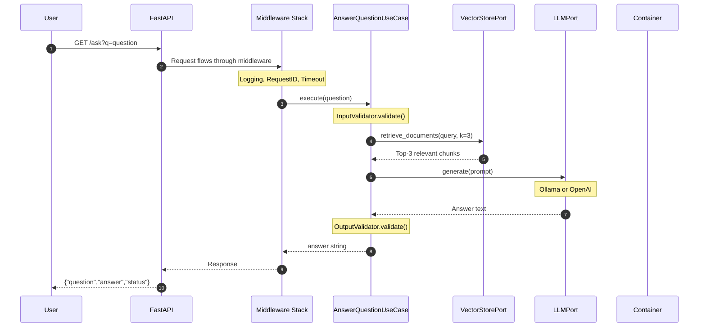
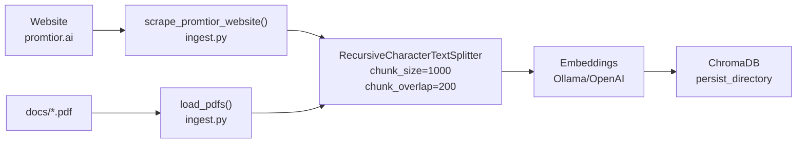
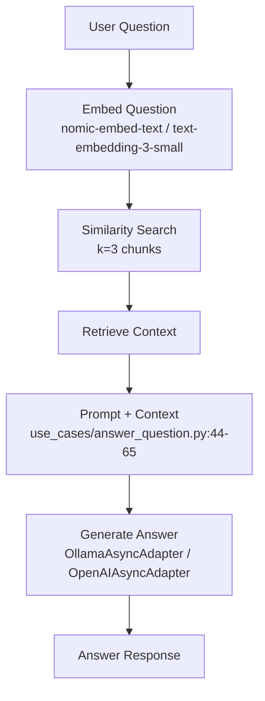

# Arquitectura del Sistema

## 1. Overview

Este documento describe la arquitectura técnica del Promtior RAG Chatbot Assistant, un sistema de Retrieval Augmented Generation (RAG) que responde preguntas sobre Promtior utilizando inteligencia artificial.

El sistema implementa **Clean Architecture (Hexagonal)** con las siguientes capas:
- **Domain**: Entidades, puertos (interfaces) y servicios de validación
- **Application**: Casos de uso
- **Infrastructure**: Implementaciones de adapters, factories, Container DI
- **Presentation**: API FastAPI, middlewares, schemas

## 2. Architecture Diagram



## 3. Request Flow



## 4. Component Details

### 4.1 FastAPI Application (`main.py`)

| Componente | Línea | Propósito |
|------------|-------|-----------|
| `app = FastAPI()` | 67-72 | Inicialización de aplicación FastAPI con lifespan |
| LoggingMiddleware | 132 | Request/response logging |
| RequestIDMiddleware | 133 | Request ID propagation |
| TimeoutMiddleware | 134 | Request timeout (60s default) |
| Exception handlers | 76-128 | Custom error handling |
| `/` endpoint | 149-161 | API info |
| `/health` endpoint | 164-167 | Basic health check |
| `/health/live` endpoint | 170-173 | Kubernetes liveness probe |
| `/health/ready` endpoint | 176-189 | Kubernetes readiness probe |
| `/ask` endpoint | 229-251 | Legacy endpoint |
| `/admin/reingest` endpoint | 192-226 | Data re-ingestion |
| `/api/v1/ask` endpoint | routes.py:11-36 | v1 API endpoint |

### 4.2 Configuration (`config.py`)

| Variable | Línea | Descripción |
|----------|-------|-------------|
| `Settings` class | 7-25 | Configuración centralizada con Pydantic |
| Environment switching | 15-18 | Dual support (Ollama/OpenAI) |
| ChromaDB path | 19-22 | Directorio de persistencia |

### 4.3 Domain Layer

| Componente | Archivo | Propósito |
|------------|---------|-----------|
| `LLMPort` | `domain/ports/llm_port.py` | Interface para providers LLM |
| `VectorStorePort` | `domain/ports/vector_store_port.py` | Interface para vector store |
| `EmbeddingsPort` | `domain/ports/embeddings_port.py` | Interface para embeddings |
| `InputValidator` | `domain/services/validators.py:18-48` | Validación de entrada |
| `OutputValidator` | `domain/services/validators.py:51-73` | Validación de salida |

### 4.4 Application Layer

| Componente | Archivo | Propósito |
|------------|---------|-----------|
| `AnswerQuestionUseCase` | `application/use_cases/answer_question.py` | Caso de uso principal con retry logic |

### 4.5 Infrastructure Layer

| Componente | Archivo | Propósito |
|------------|---------|-----------|
| `Container` | `infrastructure/container.py` | Dependency Injection con singleton pattern |
| `create_llm()` | `infrastructure/factories.py:9-38` | Factory para LLM |
| `create_embeddings()` | `infrastructure/factories.py:41-65` | Factory para embeddings |
| `OllamaAsyncAdapter` | `infrastructure/llm/ollama_async_adapter.py` | Adapter async para Ollama |
| `OpenAIAsyncAdapter` | `infrastructure/llm/openai_async_adapter.py` | Adapter async para OpenAI |
| `ChromaAdapter` | `infrastructure/vector_store/chroma_adapter.py` | Adapter para ChromaDB |
| `UsageTracker` | `infrastructure/persistence/usage_tracker.py` | Tracking de uso y costos |

### 4.6 Presentation Layer

| Componente | Archivo | Propósito |
|------------|---------|-----------|
| Middleware stack | `presentation/middleware/` | Logging, RequestID, Timeout |
| Request schemas | `presentation/schemas/request.py` | Pydantic request models |
| Response schemas | `presentation/schemas/response.py` | Pydantic response models |
| Exception handlers | `presentation/exceptions.py` | Custom exceptions |

## 5. Dependency Injection Container

El sistema implementa un Container pattern para gestión de dependencias:

```python
# infrastructure/container.py:33-46
class Container:
    @classmethod
    async def initialize(cls):
        cls._llm = create_llm()
        cls._embeddings = create_embeddings()
        cls._vector_store = ChromaVectorStoreAdapter(
            persist_directory=settings.chroma_persist_directory,
            embeddings=cls._embeddings,
        )
```

| Método | Propósito |
|--------|-----------|
| `get_llm()` | Retorna singleton de LLM |
| `get_embeddings()` | Retorna singleton de embeddings |
| `get_vector_store()` | Retorna instancia de ChromaAdapter |
| `initialize()` | Inicializa todos los singletons |
| `cleanup()` | Limpia recursos |

## 6. Environment Configuration

| Variable | Dev Default | Production | Descripción |
|----------|-------------|------------|-------------|
| `ENVIRONMENT` | `development` | `production` | Environment mode |
| `LLM_PROVIDER` | `ollama` | `openai` | LLM provider |
| `OLLAMA_BASE_URL` | `http://localhost:11434` | — | Ollama server URL |
| `OLLAMA_MODEL` | `tinyllama` | — | Ollama model name |
| `OPENAI_API_KEY` | — | **Required** | OpenAI API key |
| `OPENAI_MODEL` | `gpt-4o-mini` | `gpt-4o-mini` | OpenAI model name |

## 7. Data Flow

### 7.1 Ingestion Flow



### 7.2 Query Flow



## 8. Technology Stack

| Categoria | Tecnologia | Version |
|-----------|------------|---------|
| Web Framework | FastAPI | 0.100+ |
| Architecture | Clean/Hexagonal | — |
| RAG Framework | LangChain Core | — |
| Vector Database | ChromaDB | 0.4+ |
| Development LLM | Ollama (tinyllama) | Latest |
| Production LLM | OpenAI (gpt-4o-mini) | Latest |
| Embeddings | nomic-embed-text / text-embedding-3-small | Latest |
| PDF Processing | pypdf | 6.7+ |
| Deployment | Railway | Latest |
| Package Manager | uv | Latest |
| Linter | ruff | Latest |
| Testing | pytest | 9.0+ |

## 9. Testing Coverage

El proyecto mantiene **96%+ coverage** en código no-legacy:

```
TOTAL                                                                    394      9     40      3  96.58%
```

| Capa | Coverage |
|------|----------|
| Domain | 95%+ |
| Application | 100% |
| Infrastructure | 90%+ |
| Presentation | 80%+ |

## 10. Prompt Template

El sistema utiliza un prompt en español definido en `use_cases/answer_question.py:54-65`:

```
Eres un asistente que responde preguntas sobre Promtior,
una empresa de consultoría tecnológica y organizacional especializada
en inteligencia artificial.

Usa el siguiente contexto para responder la pregunta. Si no sabes la
respuesta basándote en el contexto, di que no tienes esa información.

Contexto: {context}

Pregunta: {question}

Respuesta:
```

## 11. Retry Logic

El sistema implementa retry exponencial con 3 intentos en `use_cases/answer_question.py:82-114`:

```python
max_retries = 3
for attempt in range(max_retries):
    try:
        # RAG execution
    except Exception as e:
        wait_time = 2 ** attempt  # 1s, 2s, 4s
        await asyncio.sleep(wait_time)
```

## 12. Legacy vs Clean Code

### Code to Replace (Legacy)

| Archivo | Estado | Notas |
|---------|--------|-------|
| `rag.py` | Legacy | Factory functions con lru_cache |
| `rag_service.py` | Legacy | Singleton con lru_cache |
| `ingest.py` | Legacy | Script de ingestión |

### Clean Architecture (Active)

| Capa | Directorio | Estado |
|------|------------|--------|
| Domain | `domain/` | ✅ Active |
| Application | `application/` | ✅ Active |
| Infrastructure | `infrastructure/` | ✅ Active |
| Presentation | `presentation/` | ✅ Active |

## 13. Source Code References

| Archivo | Capa | Propósito |
|---------|------|-----------|
| `main.py` | Presentation | FastAPI app, endpoints, middleware |
| `config.py` | Infrastructure | Settings, environment vars |
| `container.py` | Infrastructure | Dependency injection |
| `factories.py` | Infrastructure | LLM/Embeddings factories |
| `answer_question.py` | Application | Use case principal |
| `validators.py` | Domain | Input/Output validation |
| `llm_port.py` | Domain | LLM interface |
| `vector_store_port.py` | Domain | Vector store interface |
| `ollama_async_adapter.py` | Infrastructure | Ollama LLM adapter |
| `openai_async_adapter.py` | Infrastructure | OpenAI LLM adapter |
| `chroma_adapter.py` | Infrastructure | ChromaDB adapter |
| `ingest.py` | Infrastructure | Data ingestion (legacy) |
