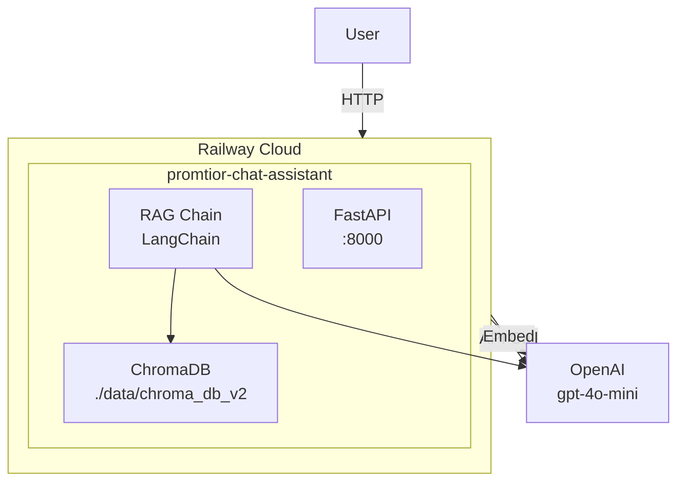

# Railway Deployment Guide

## Prerequisites

| Requirement | Description |
|-------------|-------------|
| Railway Account | Sign up at [railway.app](https://railway.app) |
| Railway CLI | Install via `npm install -g railway` |
| GitHub Repository | Code must be in GitHub |
| OpenAI Account | For production API key |

## Deployment Steps

### 1. Connect Repository to Railway

1. Go to [railway.app](https://railway.app)
2. Create new project: **"New Project"** → **"Deploy from GitHub repo"**
3. Select your repository: `urrestarazu-alejandro/promtior-chat-assistant`
4. Railway will detect the Dockerfile automatically

### 2. Configure Environment Variables

In Railway dashboard, go to **Variables** tab and add:

| Variable | Value | Description |
|----------|-------|-------------|
| `ENVIRONMENT` | `production` | Set production mode |
| `LLM_PROVIDER` | `openai` | Use OpenAI LLM |
| `OPENAI_API_KEY` | `sk-...` | Your OpenAI API key |
| `USE_OPENAI_EMBEDDINGS` | `true` | Use OpenAI embeddings |
| `OPENAI_MODEL` | `gpt-4o-mini` | Model to use |
| `OPENAI_EMBEDDING_MODEL` | `text-embedding-3-small` | Embeddings model |
| `ADMIN_REINGEST_KEY` | `promtior_reingest_2024` | Key for re-ingest |

### 3. Deploy

Click **"Deploy"** button in Railway dashboard.

Or via CLI:

```bash
# Login
railway login

# Link project
railway link

# Deploy
railway up --detach -m "Initial production deployment"
```

### 4. Verify Deployment

```bash
# Check health
curl https://your-project.up.railway.app/health

# Test question
curl "https://your-project.up.railway.app/ask?q=What is Promtior?"
```

## Railway Service Configuration

The service is configured with:

```json
{
  "source": {
    "repo": "urrestarazu-alejandro/promtior-chat-assistant"
  },
  "build": {
    "builder": "DOCKERFILE",
    "dockerfilePath": "Dockerfile"
  },
  "deploy": {
    "numReplicas": 1,
    "startCommand": null
  }
}
```

### Dockerfile

```dockerfile
# src/promtior_assistant/Dockerfile
FROM python:3.12-slim

WORKDIR /app
COPY --from=ghcr.io/astral-sh/uv:latest /uv /bin/uv
COPY pyproject.toml ./
RUN uv pip install --system -r pyproject.toml
COPY src/ ./src/
COPY data/ ./data/
COPY docs/ ./docs/

EXPOSE 8000
CMD ["uvicorn", "src.promtior_assistant.main:app", "--host", "0.0.0.0", "--port", "8000", "--proxy-headers", "--forwarded-allow-ips=*"]
```

## Managing the Deployment

### View Logs

```bash
railway logs --lines 50
```

### Redeploy

```bash
railway redeploy -y
```

### Restart

```bash
railway restart -y
```

## Re-ingest Data in Production

After deployment, you need to ingest the knowledge base:

```bash
curl -X POST 'https://your-project.up.railway.app/admin/reingest?admin_key=promtior_reingest_2024'
```

Response:
```json
{
  "status": "success",
  "message": "Data re-ingested successfully"
}
```

## Production Architecture



## Troubleshooting

### Deployment Fails

```bash
# Check build logs
railway logs --build --lines 100
```

### 500 Error on /ask

```bash
# Check deployment logs
railway logs --lines 50

# Common causes:
# - Invalid OPENAI_API_KEY
# - ChromaDB dimension mismatch
```

### Dimension Mismatch Error

If you see: `Collection expecting embedding with dimension of 768, got 1536`

```bash
# Redeploy to pick up new config
railway redeploy -y

# Then re-ingest
curl -X POST 'https://your-project.up.railway.app/admin/reingest?admin_key=promtior_reingest_2024'
```

### Read-only Database Error

If you see: `attempt to write a readonly database`

```bash
# Redeploy the service
railway redeploy -y

# Then re-ingest
curl -X POST 'https://your-project.up.railway.app/admin/reingest?admin_key=promtior_reingest_2024'
```

## Cost Management

| Resource | Estimated Cost |
|----------|----------------|
| Railway Service | ~$5-10/month |
| OpenAI API | ~$2-10/month (depending on usage) |

### OpenAI Cost Breakdown

| Model | Input | Output | Notes |
|-------|-------|--------|-------|
| gpt-4o-mini | $0.15/1M | $0.60/1M | Default, cost-effective |
| gpt-4o | $2.50/1M | $10.00/1M | Higher quality |
| text-embedding-3-small | $0.02/1M | - | Embeddings |

## Domain Configuration (Optional)

 Railway provides a default domain: `promtior-chat-assistant-production.up.railway.app`

To add custom domain:
1. Go to **Settings** → **Domains** in Railway dashboard
2. Add your custom domain
3. Update DNS records

## Scaling

To increase replicas:

```bash
railway environment edit --json <<< '{"services":{"SERVICE_ID":{"deploy":{"numReplicas":2}}}}'
```

## Environment Variables Reference

| Variable | Required | Default | Description |
|----------|----------|---------|-------------|
| `ENVIRONMENT` | Yes | development | production/development |
| `LLM_PROVIDER` | Yes | auto | openai/ollama |
| `OPENAI_API_KEY` | Yes* | - | OpenAI key (*required in production) |
| `OPENAI_MODEL` | No | gpt-4o-mini | Model name |
| `OPENAI_EMBEDDING_MODEL` | No | text-embedding-3-small | Embeddings model |
| `USE_OPENAI_EMBEDDINGS` | No | false | Use OpenAI embeddings |
| `CHROMA_PERSIST_DIRECTORY` | No | ./data/chroma_db_v2 | ChromaDB path |
| `ADMIN_REINGEST_KEY` | No | - | Admin key for re-ingest |
