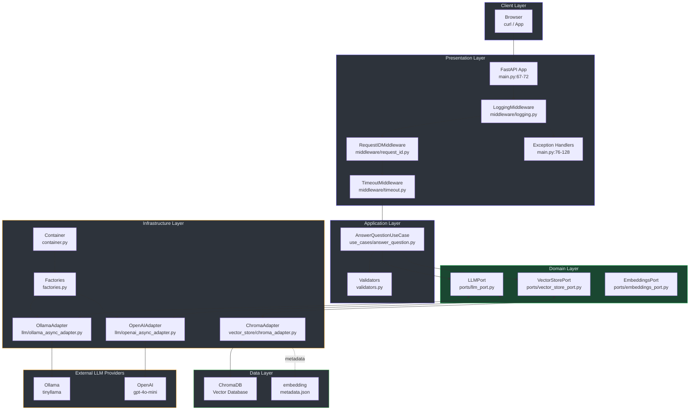
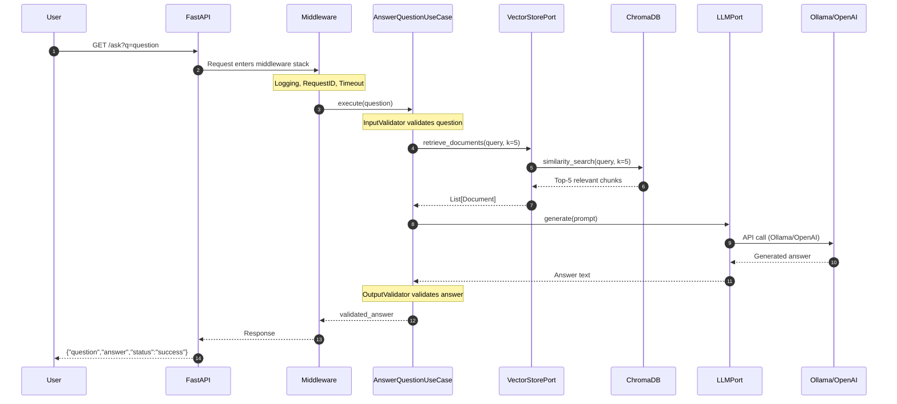
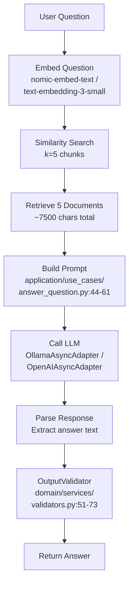
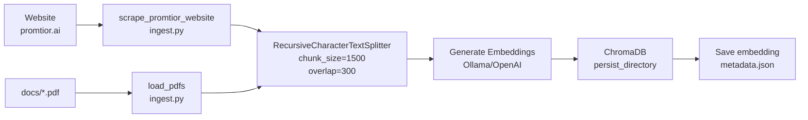

# Promtior RAG Chatbot Assistant - Technical Documentation

## 1. Project Overview

### 1.1 Objective

This project implements a Retrieval Augmented Generation (RAG) chatbot for **Promtior**, a technology and organizational consulting company specializing in artificial intelligence. The chatbot answers questions about the company using context retrieved from Promtior's website and documentation (`src/promtior_assistant/main.py:67-72`).

### 1.2 Approach Summary

I approached the challenge by implementing a production-ready RAG system with the following key decisions:

1. **Clean Architecture**: Separated concerns into Domain, Application, Infrastructure, and Presentation layers for maintainability and testability (`docs/ARCHITECTURE.md:12-16`)

2. **Dual LLM Provider Support**: Implemented factory pattern to support both Ollama (development) and OpenAI (production) (`src/promtior_assistant/infrastructure/factories.py:9-38`)

3. **Async-First Design**: All operations are async to handle concurrent requests efficiently (`src/promtior_assistant/application/use_cases/answer_question.py:63-110`)

4. **Production-Ready Features**: Health checks, middleware stack, exception handlers, and Kubernetes readiness probes (`main.py:164-189`)

### 1.3 Main Challenges Encountered

| Challenge | Impact | Solution Implemented |
|-----------|--------|---------------------|
| **Silent Embedding Mismatches** | Switching providers caused cryptic ChromaDB errors | Embedding metadata tracking with startup validation (`domain/models/embedding_metadata.py:13-118`) |
| **Language Inconsistency** | Hardcoded Spanish prompts forced all responses in Spanish | Multi-language prompt system (`application/use_cases/answer_question.py:44-61`) |
| **Information Retrieval Gaps** | Small context (3 chunks × 1000 chars) missed relevant info | Optimized retrieval: k=5, chunk_size=1500, overlap=300 |
| **Connection Pooling** | Memory leaks from creating new LLM connections per request | Singleton Container pattern (`infrastructure/container.py:33-46`) |

---

## 2. System Architecture

### 2.1 High-Level Component Diagram



### 2.2 Request Flow Sequence Diagram



---

## 3. Component Details

### 3.1 Core Components

| Component | File | Purpose |
|-----------|------|---------|
| `FastAPI App` | `main.py:67-72` | Entry point with lifespan management |
| `AnswerQuestionUseCase` | `application/use_cases/answer_question.py:13-43` | Orchestrates RAG pipeline with retry logic |
| `Container` | `infrastructure/container.py:33-46` | Singleton DI for LLM, embeddings, vector store |
| `ChromaAdapter` | `infrastructure/vector_store/chroma_adapter.py:17-77` | Vector store with metadata validation |
| `LLMPort` | `domain/ports/llm_port.py:10-25` | Interface for LLM providers |

### 3.2 RAG Pipeline Implementation

The main use case follows this flow (`application/use_cases/answer_question.py:63-110`):

```python
async def execute(self, question: str) -> str:
    # 1. Validate input
    validated_question = self._input_validator.validate(question)

    # 2. Retry loop (3 attempts with exponential backoff)
    for attempt in range(max_retries):
        try:
            # 3. Retrieve documents (k=5)
            documents = await self._vector_store.retrieve_documents(
                query=validated_question,
                k=5,
            )

            # 4. Build context (~7500 chars)
            context = "\n\n".join(doc.page_content for doc in documents)

            # 5. Generate answer
            prompt = self._build_prompt(validated_question, context)
            answer = await self._llm.generate(prompt, temperature=0.1)

            # 6. Validate output
            return self._output_validator.validate(answer)
        except Exception as e:
            # Exponential backoff: 1s, 2s, 4s
            await asyncio.sleep(2 ** attempt)
```

### 3.3 Embedding Metadata System

The metadata tracking prevents silent failures when switching between embedding providers (`domain/models/embedding_metadata.py:13-118`):

```python
@dataclass
class EmbeddingMetadata:
    provider: EmbeddingProvider
    model: str
    dimension: int

    @classmethod
    def from_ollama(cls, model: str) -> "EmbeddingMetadata":
        return cls(provider=EmbeddingProvider.OLLAMA, model=model, dimension=768)

    @classmethod
    def from_openai(cls, model: str) -> "EmbeddingMetadata":
        dimensions = {"text-embedding-3-small": 1536, "text-embedding-3-large": 3072}
        return cls(
            provider=EmbeddingProvider.OPENAI,
            model=model,
            dimension=dimensions.get(model, 1536),
        )
```

---

## 4. Data Flow

### 4.1 Query Flow (Detailed)



### 4.2 Ingestion Flow



---

## 5. Technology Stack

| Category | Technology | Version |
|----------|------------|---------|
| Web Framework | FastAPI | 0.100+ |
| Architecture | Clean/Hexagonal | v2.1 |
| RAG Framework | LangChain Core | Latest |
| Vector Database | ChromaDB | 0.4+ |
| Development LLM | Ollama (tinyllama) | Latest |
| Production LLM | OpenAI (gpt-4o-mini) | Latest |
| Embeddings | nomic-embed-text / text-embedding-3-small | Latest |
| Package Manager | uv | Latest |
| Linter | ruff | Latest |
| Testing | pytest | 9.0+ |

---

## 6. API Endpoints

| Method | Path | Description |
|--------|------|-------------|
| GET | `/` | API info and usage examples |
| GET | `/health` | Basic health check |
| GET | `/health/live` | Kubernetes liveness probe |
| GET | `/health/ready` | Kubernetes readiness probe |
| GET | `/ask?q=<question>` | Ask a RAG question |
| POST | `/admin/reingest` | Re-ingest data into ChromaDB |
| POST | `/api/v1/ask` | v1 API endpoint with schemas |

---

## 7. Testing Coverage

The project maintains **96%+ code coverage** on non-legacy code:

```
tests/unit/test_answer_question_use_case.py   - Use case with retry logic
tests/unit/test_chroma_adapter.py              - Vector store adapter
tests/unit/test_container.py                  - DI container
tests/unit/test_factories.py                  - LLM/Embeddings factories
tests/unit/test_validators.py                  - Input/Output validation
tests/unit/test_adapters.py                    - LLM adapters
tests/test_api.py                              - API endpoints
```

---

## 8. Deployment

The application is deployed on **Railway** with the following configuration:

- **Runtime**: Python 3.12+
- **Build**: uv package manager
- **Production LLM**: OpenAI gpt-4o-mini
- **Production Embeddings**: OpenAI text-embedding-3-small
- **Database**: ChromaDB (ephemeral storage on Railway)

---

## 9. References

| Source | Location | Description |
|--------|----------|-------------|
| Main Application | `src/promtior_assistant/main.py:1-272` | FastAPI app with all endpoints |
| Use Case | `src/promtior_assistant/application/use_cases/answer_question.py:1-111` | RAG orchestration |
| Container | `src/promtior_assistant/infrastructure/container.py:1-83` | DI singleton pattern |
| Chroma Adapter | `src/promtior_assistant/infrastructure/vector_store/chroma_adapter.py:1-145` | Vector store with metadata |
| Embedding Metadata | `src/promtior_assistant/domain/models/embedding_metadata.py:1-118` | Metadata tracking |
| Validators | `src/promtior_assistant/domain/services/validators.py:1-96` | Input/Output validation |
| Factories | `src/promtior_assistant/infrastructure/factories.py:1-70` | LLM/Embeddings factories |
| Architecture Doc | `docs/ARCHITECTURE.md:1-346` | Detailed architecture |
| RAG Improvements | `docs/RAG_V2_IMPROVEMENTS.md:1-828` | v2.1 technical deep-dive |
