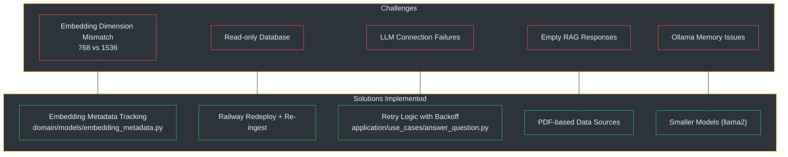

# Troubleshooting Guide

## 1. Overview

This guide documents the challenges encountered during the production deployment of the Promtior RAG Chatbot and their solutions. The system uses **Clean Architecture** with FastAPI, LangChain, ChromaDB, and dual LLM support (Ollama for development, OpenAI for production).

---

## 2. Challenge Categories

### 2.1 Challenge Map



---

## 3. Embedding Dimension Mismatch

### Error Message
```
"Collection expecting embedding with dimension of 768, got 1536"
```

### Root Cause

ChromaDB stores vectors with a fixed dimension. When the vector store is populated with Ollama embeddings (768 dimensions via `nomic-embed-text` at `src/promtior_assistant/domain/models/embedding_metadata.py:38-52`), switching to OpenAI embeddings (1536 dimensions via `text-embedding-3-small` at `src/promtior_assistant/domain/models/embedding_metadata.py:54-75`) causes ChromaDB to reject queries because the dimensions don't match (`src/promtior_assistant/infrastructure/vector_store/chroma_adapter.py:114-145`).

This is a **silent failure** scenario: the application starts without errors, but every query fails with a confusing dimension mismatch message.

### Solution Implemented

**Embedding Metadata Tracking System** (`src/promtior_assistant/domain/models/embedding_metadata.py:13-118`):

```python
class EmbeddingMetadata:
    """Metadata about embeddings used in vector store."""

    def __init__(self, provider: EmbeddingProvider | str, model: str, dimension: int):
        self.provider = EmbeddingProvider(provider) if isinstance(provider, str) else provider
        self.model = model
        self.dimension = dimension

    @classmethod
    def from_ollama(cls, model: str) -> "EmbeddingMetadata":
        return cls(provider=EmbeddingProvider.OLLAMA, model=model, dimension=768)

    @classmethod
    def from_openai(cls, model: str) -> "EmbeddingMetadata":
        dimension_map = {"text-embedding-3-small": 1536, "text-embedding-3-large": 3072}
        dimension = dimension_map.get(model, 1536)
        return cls(provider=EmbeddingProvider.OPENAI, model=model, dimension=dimension)
```

The `ChromaAdapter` validates metadata at startup (`src/promtior_assistant/infrastructure/vector_store/chroma_adapter.py:52-53`):

```python
if validate_metadata and self._persist_directory.exists():
    self._validate_metadata()
```

If validation fails, it raises `EmbeddingMismatchError` with a clear message explaining the expected vs actual configuration.

### Quick Fix (Without Code Change)

```bash
# Remove existing ChromaDB and re-ingest with correct embeddings
rm -rf data/chroma_db
make ingest
```

---

## 4. Read-Only Database Error

### Error Message
```
"Database error: attempt to write a readonly database"
```

### Root Cause

This error occurs in **Railway deployment** because ChromaDB requires write access to the filesystem. Railway's ephemeral storage (`/tmp/chroma_db`) can have permission issues, especially after redeployment or when the directory was created with different permissions (`src/promtior_assistant/config.py:48-54`).

In production, ChromaDB uses `/tmp/chroma_db` (tempfile):
```python
@property
def chroma_persist_directory(self) -> str:
    if self.environment == "production":
        return os.environ.get("CHROMA_DB_PATH", os.path.join(tempfile.gettempdir(), "chroma_db"))
    return "./data/chroma_db"
```

### Solution

```bash
# Redeploy on Railway
railway redeploy -y

# Then re-ingest data
curl -X POST 'https://promtior-chat-assistant-production.up.railway.app/admin/reingest?admin_key=YOUR_KEY'
```

### Prevention

The ingest script removes existing ChromaDB directory before creating a new one (`src/promtior_assistant/ingest.py:202-206`):

```python
chroma_path = Path(settings.chroma_persist_directory)
if chroma_path.exists():
    print(f"   🗑️  Removing existing ChromaDB at {chroma_path}")
    shutil.rmtree(chroma_path)
```

---

## 5. LLM Connection Failures

### Error Message
```
"Failed to generate RAG answer after 3 attempts"
```

### Root Cause

The LLM provider (either Ollama or OpenAI) is unreachable due to network issues, incorrect configuration, or service unavailability. This can happen when:

1. **Ollama** is not running in development (`src/promtior_assistant/infrastructure/llm/ollama_async_adapter.py`)
2. **OpenAI API key** is missing or invalid in production (`src/promtior_assistant/infrastructure/llm/openai_async_adapter.py`)
3. **Network timeout** between the app and LLM provider
4. **Environment not set correctly** - LLM provider defaults to `openai` in production (`src/promtior_assistant/config.py:24-29`)

### Solution Implemented

**Retry Logic with Exponential Backoff** (`src/promtior_assistant/application/use_cases/answer_question.py:78-110`):

```python
max_retries = 3
for attempt in range(max_retries):
    try:
        answer = await self._llm.generate(prompt, temperature=0.1)
        return self._output_validator.validate(answer)
    except Exception as e:
        if attempt < max_retries - 1:
            wait_time = 2 ** attempt  # 1s, 2s, 4s
            logger.warning(f"RAG call failed (attempt {attempt + 1}/{max_retries}), retrying in {wait_time}s")
            await asyncio.sleep(wait_time)
        else:
            logger.error(f"RAG call failed after {max_retries} attempts: {e}")
```

### Debugging Steps

```bash
# Check Railway logs
railway logs --lines 50

# Verify environment variables are set
railway env

# Test health endpoint
curl https://promtior-chat-assistant-production.up.railway.app/health

# Test with simple question
curl 'https://promtior-chat-assistant-production.up.railway.app/ask?q=test'
```

---

## 6. Empty or "No Information" Responses

### Error Messages
```
"Empty response from AI"
```
```
"No tengo esa información" (or English equivalent)
```

### Root Cause

The RAG system cannot find relevant documents in ChromaDB to answer the question. This occurs when:

1. **ChromaDB is empty** - No data has been ingested yet
2. **Content not in sources** - The question asks about information not present in the website or PDFs
3. **Chunking lost information** - The text splitter (`src/promtior_assistant/ingest.py:155-171`) may have split content in ways that lose semantic meaning
4. **Wix JavaScript content** - The website uses dynamic JavaScript (Wix) that BeautifulSoup cannot scrape (`src/promtior_assistant/ingest.py:77-109`)

### Solution: PDF-Based Data Sources

The most reliable solution is to use PDF documents as the primary data source (`src/promtior_assistant/ingest.py:45-74`):

```python
def load_pdfs() -> list[Document]:
    """Load all PDFs from the docs directory."""
    if not PDF_DIR.exists():
        print(f"⚠️  PDF directory not found: {PDF_DIR}")
        return []

    documents = []
    for pdf_path in pdf_files:
        reader = PdfReader(str(pdf_path))
        text = ""
        for page in reader.pages:
            text += page.extract_text() + "\n"
        documents.append(Document(page_content=text, metadata={"source": str(pdf_path.name), "type": "pdf"}))
    return documents
```

The ingestion prioritizes PDFs over website content (`src/promtior_assistant/ingest.py:135-146`):

```python
# Step 1: Load PDFs first (priority - detailed company info like founding date)
pdf_docs = load_pdfs()
all_documents.extend(pdf_docs)

# Step 2: Scrape website (supplementary info)
try:
    doc = scrape_promtior_website()
    all_documents.append(doc)
except Exception as e:
    logger.warning(f"Website scraping failed: {e}")
```

### Quick Verification

```bash
# 1. Re-ingest data
curl -X POST 'https://promtior-chat-assistant-production.up.railway.app/admin/reingest?admin_key=YOUR_KEY'

# 2. Verify success response
# Expected: {"status":"success","message":"Data re-ingested successfully"}

# 3. Test with known question
curl 'https://promtior-chat-assistant-production.up.railway.app/ask?q=What services does Promtior offer?'
```

---

## 7. Ollama Connection Issues (Development)

### Error Messages
```
"Connection refused to localhost:11434"
```
```
"Ollama model not found"
```

### Root Cause

Ollama is not running, not accessible on the expected port, or the model is not pulled.

### Solution

```bash
# Verify Ollama is running
docker ps | grep ollama

# Restart Ollama container
docker restart promtior-ollama

# View logs
docker logs promtior-ollama

# Pull required models (if missing)
ollama pull tinyllama
ollama pull nomic-embed-text
```

### Using Docker Compose

```bash
# Start Ollama only
docker-compose up -d ollama

# Or start full stack
docker-compose -f docker-compose.full.yml up -d
```

---

## 8. Ollama Memory Issues

### Error Message
```
"Out of memory" or system becomes unresponsive
```

### Root Cause

Ollama models require significant RAM. The default model `llama2` needs ~4GB, which may exceed available memory on some systems.

### Solution: Use Smaller Models

In `.env` file:

```bash
# Development - use smaller model than default (llama2)
OLLAMA_MODEL=tinyllama  # ~1GB RAM
# Or
OLLAMA_MODEL=phi3:mini  # ~3GB RAM
```

The default Ollama model is configured in `src/promtior_assistant/config.py:33`:

```python
ollama_model: str = Field(default="llama2")
```

---

## 9. Railway Deployment Checklist

### Required Environment Variables

| Variable | Value | Description |
|----------|-------|-------------|
| `ENVIRONMENT` | `production` | Production mode |
| `LLM_PROVIDER` | `openai` | Use OpenAI |
| `OPENAI_API_KEY` | `sk-...` | OpenAI API key |
| `USE_OPENAI_EMBEDDINGS` | `true` | Use OpenAI embeddings |
| `ADMIN_REINGEST_KEY` | Custom key | Admin endpoint security |

### Verification Commands

```bash
# Health check
curl https://promtior-chat-assistant-production.up.railway.app/health

# Readiness probe
curl https://promtior-chat-assistant-production.up.railway.app/health/ready

# Test endpoint
curl 'https://promtior-chat-assistant-production.up.railway.app/ask?q=What does Promtior do?'

# Re-ingest data
curl -X POST 'https://promtior-chat-assistant-production.up.railway.app/admin/reingest?admin_key=YOUR_KEY'
```

---

## 10. Debugging Tools

### Diagnostic Script

A diagnostic tool is available at `scripts/diagnose_rag.py` for debugging retrieval issues:

```bash
python scripts/diagnose_rag.py "Your question here"
```

This script tests:
- Embedding dimensionality
- Document retrieval count
- Context size
- LLM response quality

---

## 11. References

| Source | Location | Description |
|--------|----------|-------------|
| Embedding Metadata | `src/promtior_assistant/domain/models/embedding_metadata.py:1-119` | Metadata tracking implementation |
| Chroma Adapter | `src/promtior_assistant/infrastructure/vector_store/chroma_adapter.py:52-145` | Metadata validation logic |
| Use Case Retry | `src/promtior_assistant/application/use_cases/answer_question.py:78-110` | Exponential backoff retry |
| Config | `src/promtior_assistant/config.py:48-54` | ChromaDB path configuration |
| Ingest | `src/promtior_assistant/ingest.py:45-206` | PDF loading and chunking |
| Factories | `src/promtior_assistant/infrastructure/factories.py:9-38` | LLM provider switching |
